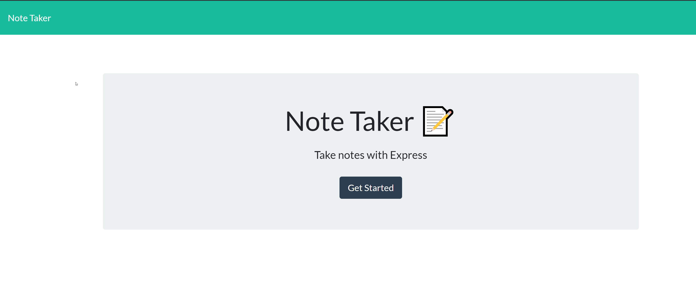
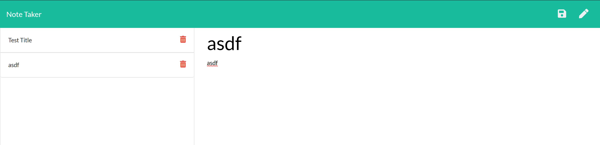

# Note Taker

 ## Description 
  This is a sample and fun Note Taker app that takes user input as a Title and Notes and allows you to save, edit, and delete notes. This app uses HTML, CSS, jQuery, Javascript, and a few node.js packages.

  ## Table of Contents
  [1.  Installation](##Installation) 

  [2.  Instructions](##Instructions)

  [3.  App](##App)
  
  [4.  Questions](##Questions)

## Installation
  This needs requires the use of the following packages:

  [Path](https://www.npmjs.com/package/path)

  [Express](https://www.npmjs.com/package/express)

## Instructions

  1.    Make sure node.js is installed.
  2.    Run npm init.
  3.    Run npm install express.
  4.    Run npm start to run the application.
  5.    In the apps current state, an initial seed file is required in the db.json file.

## Functionality
 This app opens up with a "Get Started" page which the user clicks and then is displayed with a list of saved notes on the left hand side.  On the right hand side the user enters a title for the note and note info is input below the title.  Once the title is entered, the save button appears on the far right hand side.  Once clicked, that newly entered note is moved over the saved list. 

 Behind the scenes, the page essentially reads what is in the file (AJAX call for a get from a db.json file) and populates the Saved list.  When a new note is entered and saved (AJAX call for a POST), the db.json file is updated with the new note.

 When a user clicks on the trash can on the left hand side to delete a note (AJAX call for a DELETE), the code looks for the ID that was deleted and matches it against what's in the file.  The deleted note is spliced and then the new version of the note is written back to the db.json file.   
  

## App 

  
  

## Questions

  [Github Repository](https://github.com/kurt-austin/NoteTaker)

  [Heroku Repository](https://git.heroku.com/blooming-journey-54402.git)

  [Note Taker Deployed App](https://blooming-journey-54402.herokuapp.com/)

  [Contact](kurt.austin@gmail.com)
